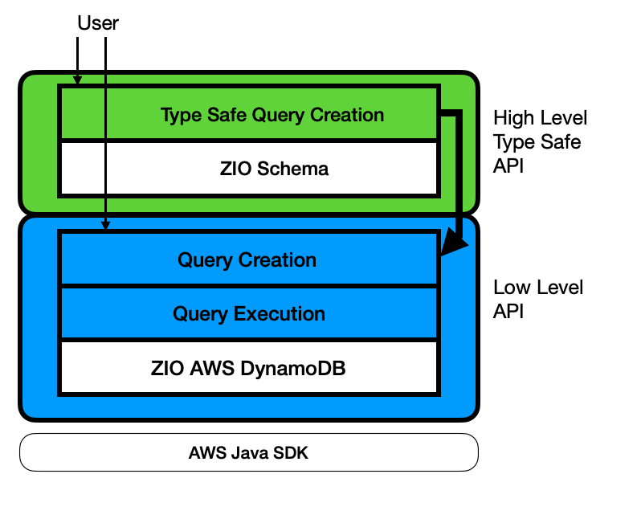

# Architecture

In the below diagram you can see the different layers of library and its dependencies.

- The user can chose to call the High Level Type Safe API which is based on types from Scala case classes (in green) or the Low Level Type Safe API (in blue) which is based on DynamoDB specific abstractions like `AttributeValue`. 
- High Level Type Safe API has a dependency on [ZIO Schema](https://zio.dev/zio-schema/) for compile time type information that is used to automatically generate codecs and in turn calls the ...
- Low Level API for query creation and execution, and which has in turn has a dependency on [ZIO AWS](https://zio.dev/zio-aws/), which in turn has a dependency on the AWS Java SDK.

Although there are two APIs, the High Level API is the recommended way to interact with the library as it provides a type safe way to interact with DynamoDB together with a huge amount of boilerplate reduction.
